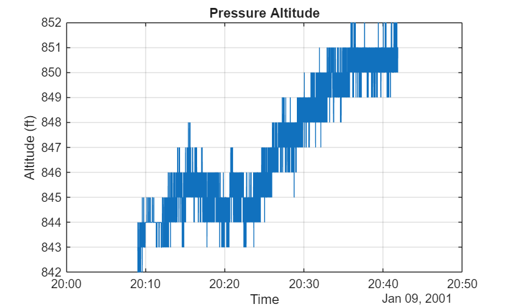
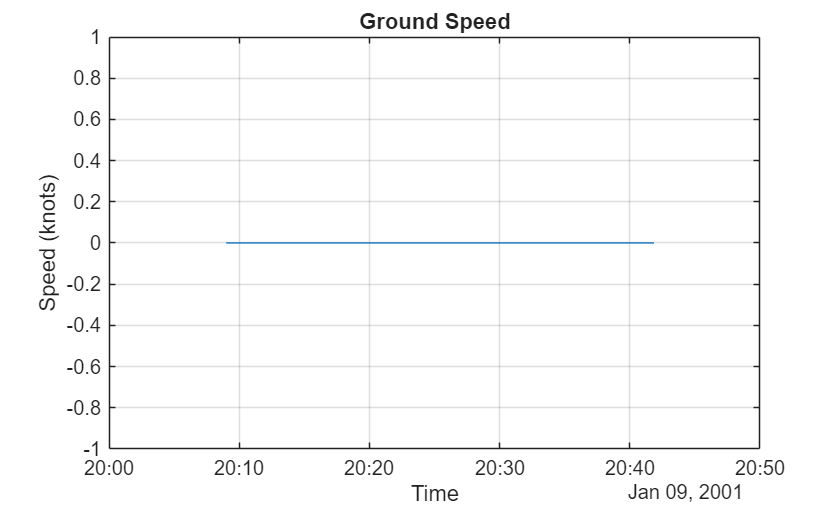
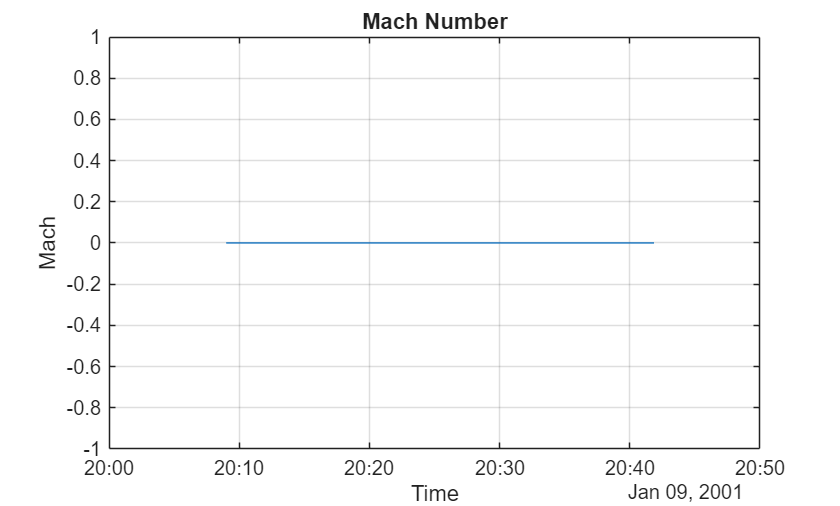
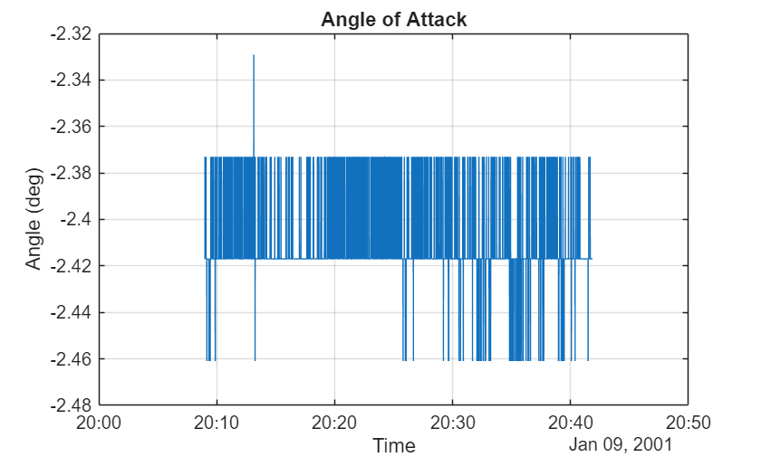
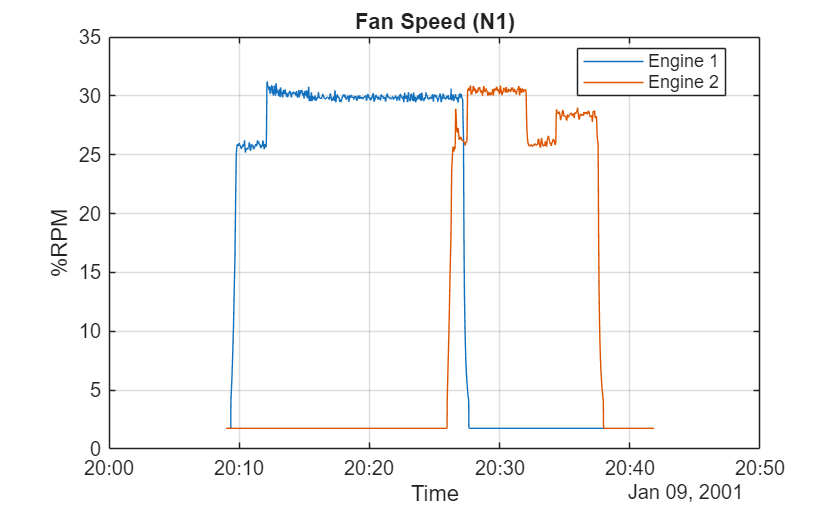
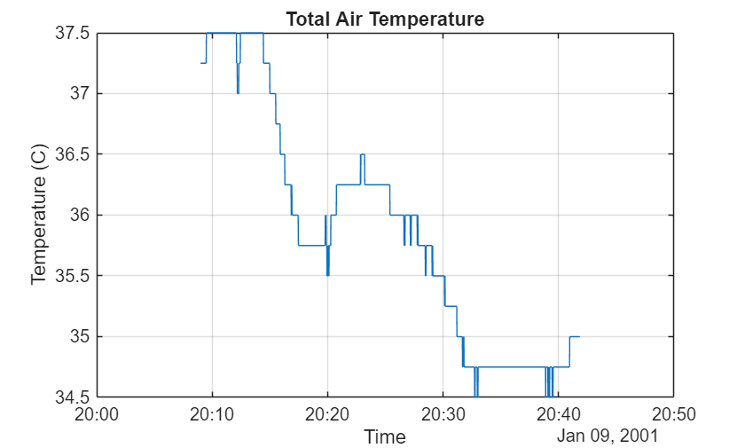

# Exploring NASA Aircraft Flight Data

This plain\-text Live Script loads one NASA DASHlink flight, converts the sensor structs into a timetable, and visualizes a small set of flight parameters from climb through descent.

# Load One Flight

The demo is self\-contained: it loads a sample MAT\-file from the local `data` folder and converts the nested sensor records into a synchronized timetable.

```matlab
demoRoot = currentProject().RootFolder;
flightFile = fullfile(demoRoot,"data","652200101092009.mat");
signals = ["ALT","GS","MACH","AOA1","N1.1","N1.2","TAT"];
nt = returnNested(flightFile);
wt = nested2wide(nt,signals);
flightSummary = table(nt.flightid(1),nt.tailnumber(1),nt.starttime(1),height(nt),sum(cellfun(@numel,nt.data)),VariableNames=["FlightID","TailNumber","StartTime","SensorCount","DataPointCount"]);
disp(flightSummary)
```

```matlabTextOutput
       FlightID        TailNumber           StartTime           SensorCount    DataPointCount
    _______________    __________    _______________________    ___________    ______________

    652200101092009       652        2001-01-09 20:09:00.000        186          8.3169e+05  
```

# Pressure Altitude

Altitude makes the main flight phases easy to identify: climb, cruise, and descent.

```matlab
plot(wt.timestamp,wt.ALT)
title("Pressure Altitude")
xlabel("Time")
ylabel("Altitude (ft)")
grid on
```


# Ground Speed

Ground speed typically rises during takeoff, stabilizes in cruise, and falls during approach.

```matlab
plot(wt.timestamp,wt.GS)
title("Ground Speed")
xlabel("Time")
ylabel("Speed (knots)")
grid on
```


# Mach Number

Mach number is the ratio of airspeed to local speed of sound and is a useful cruise\-speed indicator.

```matlab
plot(wt.timestamp,wt.MACH)
title("Mach Number")
xlabel("Time")
ylabel("Mach")
grid on
```


# Angle of Attack

Angle of attack often increases in climb and varies with aircraft configuration and control inputs.

```matlab
plot(wt.timestamp,wt.AOA1)
title("Angle of Attack")
xlabel("Time")
ylabel("Angle (deg)")
grid on
```


# Fan Speed

The two engine fan\-speed traces should remain broadly aligned through the flight.

```matlab
plot(wt.timestamp,wt.("N1.1"),wt.timestamp,wt.("N1.2"))
title("Fan Speed (N1)")
xlabel("Time")
ylabel("%RPM")
legend("Engine 1","Engine 2","Location","best")
grid on
```


# Total Air Temperature

Temperature is sampled more slowly than the other signals, so NaN values introduced by synchronization are removed before plotting.

```matlab
valid = ~isnan(wt.TAT);
plot(wt.timestamp(valid),wt.TAT(valid))
title("Total Air Temperature")
xlabel("Time")
ylabel("Temperature (C)")
grid on
```


# Signal Summary

These seven signals give a compact view of aircraft state, propulsion, and atmosphere.

| Signal  | Meaning   |
| :-- | :-- |
| ALT  | Pressure altitude   |
| GS  | Ground speed   |
| MACH  | Mach number   |
| AOA1  | Angle of attack   |
| N1.1  | Engine 1 fan speed   |
| N1.2  | Engine 2 fan speed   |
| TAT  | Total air temperature   |

```matlab
function nestedTable = returnNested(filename)
arguments
    filename (1,1) string {mustBeNonempty}
end
m = load(filename);
sensorNames = fieldnames(m);
[~,flightID,~] = fileparts(filename);
flightID = extract(flightID,lineBoundary + digitsPattern);
startTime = datetime(extractAfter(flightID,3),InputFormat="yyyyMMddHHmm",Format="yyyy-MM-dd HH:mm:ss.SSS");
tailNumber = uint16(str2double(extractBetween(flightID,1,3)));
flightID = uint64(str2double(flightID));
nestedData = cell(numel(sensorNames),1);
for ii = 1:numel(sensorNames)
    nestedData{ii} = struct2table(m.(sensorNames{ii}),AsArray=true);
end
nestedTable = vertcat(nestedData{:});
nestedTable = renamevars(nestedTable,["Alpha","data","Rate","Units","Description"],["sensorname","data","samplerate","units","description"]);
nestedTable = convertvars(nestedTable,vartype("cellstr"),"string");
nestedTable = convertvars(nestedTable,"units","categorical");
nestedTable = convertvars(nestedTable,"samplerate","single");
nestedTable.data = cellfun(@double,nestedTable.data,UniformOutput=false);
nestedTable.starttime = repelem(startTime,height(nestedTable),1);
nestedTable.tailnumber = repelem(tailNumber,height(nestedTable),1);
nestedTable.flightid = repelem(flightID,height(nestedTable),1);
nestedTable = nestedTable(:,["starttime","tailnumber","flightid","samplerate","sensorname","description","units","data"]);
nestedTable = sortrows(nestedTable,"sensorname");
end
function wideTable = nested2wide(nestedTable,vars)
arguments
    nestedTable table
    vars (:,1) string = ""
end
if vars == ""
    vars = string(unique(nestedTable.sensorname));
end
ts = nestedTable(ismember(string(nestedTable.sensorname),vars),:);
ts.timestamp = ts.starttime;
ts = table2timetable(ts,RowTimes="timestamp");
wideData = cell(1,height(ts));
for ii = 1:numel(wideData)
    wd = ts(ii,:);
    wideData{ii} = repmat(wd(1,["starttime","samplerate","sensorname"]),numel(wd.data{:}),1);
    wideData{ii}.data = wd.data{:};
    wideData{ii} = renamevars(wideData{ii},"data",string(wideData{ii}.sensorname(1)));
    wideData{ii}.timestamp = wideData{ii}.starttime + (0:height(wideData{ii}) - 1)' * seconds(1 / wideData{ii}.samplerate(1));
    wideData{ii} = wideData{ii}(:,string(wideData{ii}.sensorname(1)));
end
wideTable = synchronize(wideData{:},"regular",SampleRate=max(ts.samplerate));
wideTable.timestamp.Format = "yyyy-MM-dd HH:mm:ss.SSS";
end
```
